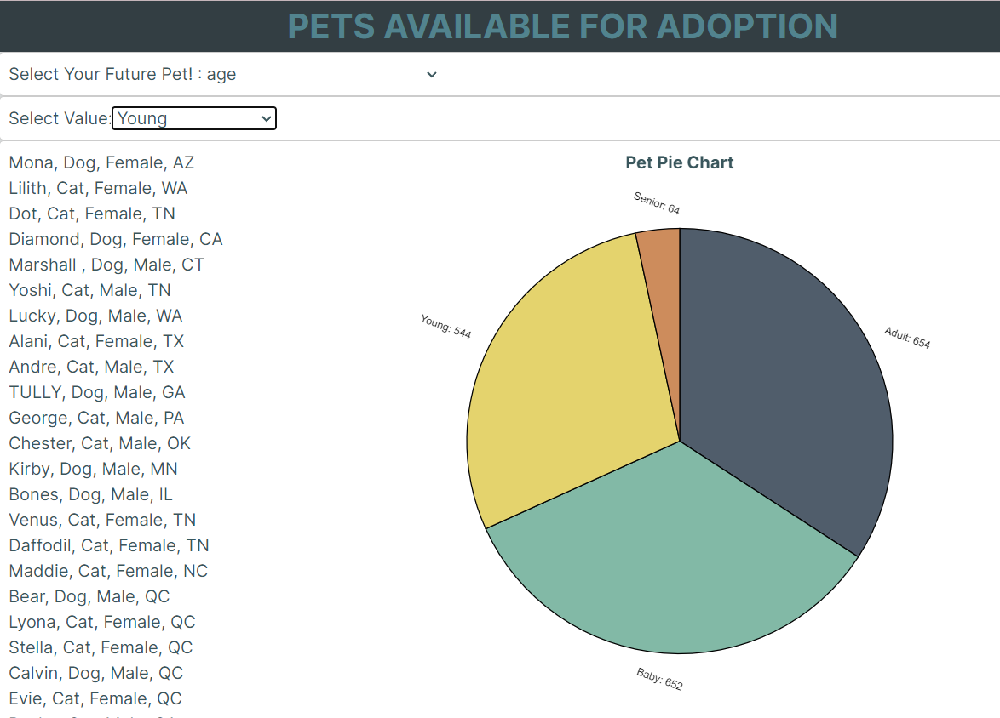
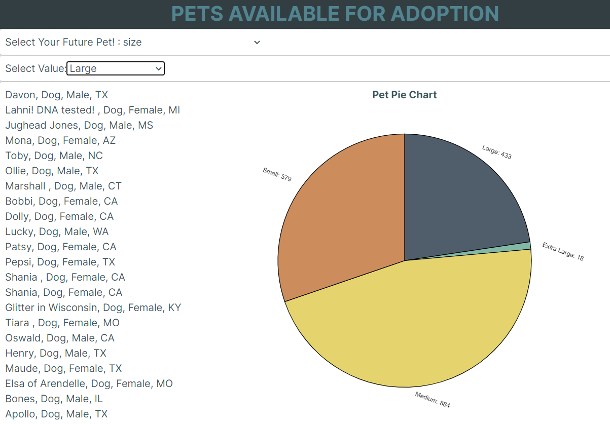
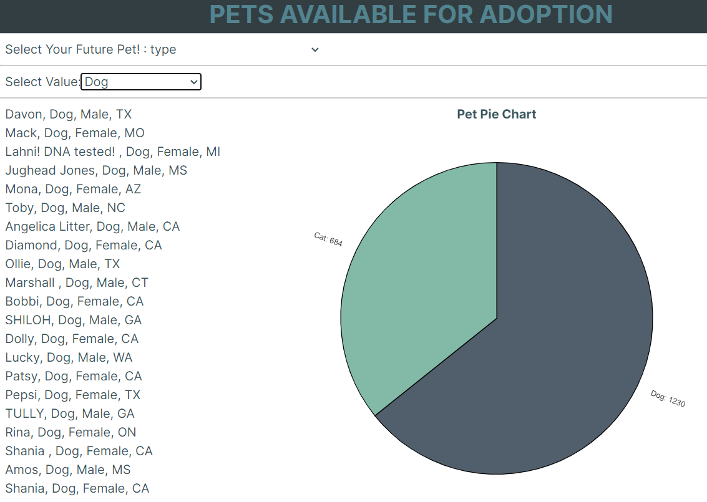

# project_3

# Animal Friends in Need
Team 1 / "Team McGriddle" : Aijha Reed, Sally Anderson, Kenia Berrios, & Kyle Novak

##  Greetings and Project Purpose
Thank you for taking the time and consideration to review our user-friendly app for those that are about to make one of the best decisions in their life… adopting a pet!

For this project, we set off to collect data about pets that are ready for adoption in the United States. We thought it would be amazing to have map visualizations to have markers indicating how many cats and dogs can be adopted for each state and drop down bars to help users filter the pet of thier dreams.
Using an API from the website [Pet Finder](https://www.petfinder.com/), we were able to find a Dog Park size of data that featured information about every pet that was available for adoption.
After reviewing the data pulled from the API, we realized that maybe the purpose of our app and visualizations should not just be to provide users with information of pets for adoption, but to showcase the data of each type, gender, age, size, and state to see where is the greater need for adoption.
We hope that our app/website brings awareness to the over-crowding of shelters out there as well as the importance of "Adopt, Don't Shop' when adding that furry friend to your life.

## Work-flow:

1. Petfinder.com API call
2. Clean data in Jupyter notebook
3. Export as cleaned data as ‘jan29_states_final.csv’
4. In MongoDB create database (project_3’) and collection (‘animals’)
5. In Flask app, create connection with pymongo using MongoClient()
6. Create route to local server by running flask app (testing.py) (http://127.0.0.1:5000/check_mongodb)
7. After, run react.js file (page.tsx) by typing in command line (npm run dev)
8. Make selection from the dropdown buttons to render different pie charts

## How to use and interact with the project

In order to run the following codes and app listed in the files listed above, please be sure to have the following installed on your computer:

* Pymongo
* Flask
* Flask_CORS
* React
* Data Component
* Axios
* Victory
* Json
* Requests
* Pathlib
    
Since you are already in our repo, please open the folder labeled FINAL Folder. Inside that folder you will find another folder labeled project_3_testing followed by one named react-template.
From there you will find numerous items. However, you will looking for and selecting the folder labeled app. Within the app folder, you will notice a the Python file labeled testing.py and a Typescript file labeld page.tsx.
These are the main files we used to run our app/website and you are welcomed to review our code from here.

If you wish to run our app/website...
* Highly reccomended that you downloaded all of the project_3 files or clone the repo on your computer.
* Using our jan29_states_final.csv file (found in the resources folder), you will need to create a database via MongoDB with the name project_3. After the database is created it is necessary to create a collection called animals.
* From here you should have all the necessary files, database, and code to run the code without any errors.
* Be sure you are still connected to localhost:27017 on MongoDB.
* Open the files labeled testing.py and pages.tsx. Once done, open 2 integrated terminals for both files.
    * For the terminal that you opened for testing.py, please type in python testing.py and hit enter. A link to open up a browser should appear.
        * You may notice that the initial site seems to have an error, but simply open the address bar and at the very end of the web address type /check_mongodb and hit enter. You should be noticing a json data set which inddicates that our MongoDB is running.
    * After that is completed, open the 2nd integrated terminal for pages.tsx and type npm run dev and hit enter. Here you will get another link to click on.
* Clicking the link provided will take you back to your internet browser where you will notice a web page with a title of Pet Available for Adoption, along with a drop down bar. Congrats you made it!
* From here you can toy around with the web browser where you be able to select from State, Gender, Size, Type, and age. When you select one of the groups you will notice that a pie chart appears to right to indicate the count/ size comparison to the sub categories within your first selection.
* You will also notice another drop down bar is added for you to do another filter by selecting one of the sub catergories. This will refine the list that is provided to show only the pets that fit that sub category.

Here are a few images taken from our site to provide for visual examples:
    

## Ethical Considerations
One point we kept in mind with our initial pull from the API was for the protection of individualizing information of the Petfinder.com users' data.
Individual contact information like phone numbers, emails, and home addresses are protected by the Petfinder website only to the extent of legal usage and 3rd parties; the grey area to be avoided is the right to usage of the data even though the permission was given by an API key.
In order to stay clear from sharing such personal infromation, we went through the pulled data and removed addresses, names, phone numbers, cities, and zip codes; Keeping only state to be able to still see where each dog and cat are located.

## Future Works
We set forth on a mission to create an user-friendly app that not only listed dogs and cats available for adoption, but to show where there was a greater need for adoption within North America.
Looking back we are proud of the visualizations created to help show users the results from the data pulled.
Looking forward, we hope to be able to take this site even further by creating a link/domain. Also, we wish to see the site to feature multiple dropdown menus for users to narrow down the sub-categories for them to find the ideal pet to adopt.

# References
1. https://analyticsindiamag.com/step-by-step-guide-to-data-analysis-using-sweetviz/
2. https://www.petfinder.com/developers/v2/docs/ 
3. https://www.shelteranimalscount.org/data-request-individuals/
4. https://rescuegroups.org/
5. https://www.washingtonpost.com/business/2022/01/07/covid-dogs-return-to-work/
6. https://pypi.org/project/sweetviz/#files
7. https://analyticsindiamag.com/step-by-step-guide-to-data-analysis-using-sweetviz/

In addition, Chat GPT version 3.5, our Teachers Assistant Jared, and Victory Chart documention were of significant help.

# References for the data source
1. https://www.petfinder.com/developers/ to request access to developer keys
2. https://www.petfinder.com/developers/v2/docs/  to use the API to build your own dynamic websites or applications
3. https://www.petfinder.com/privacy-policy/en/ to read on the privacy policy set in place